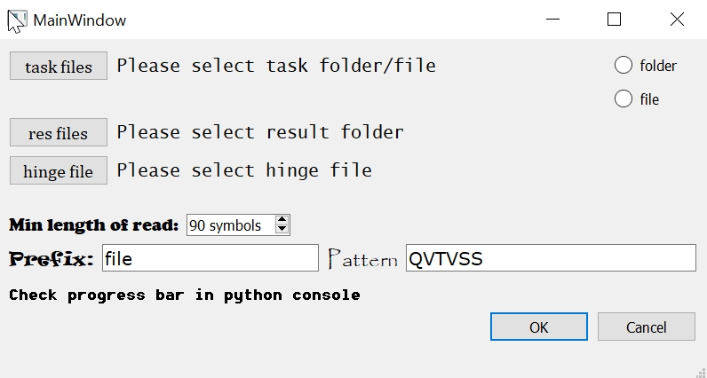
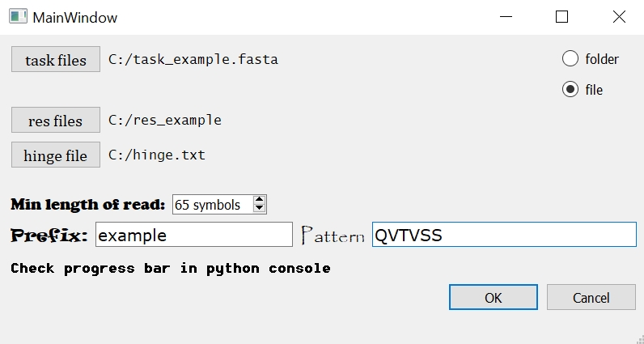
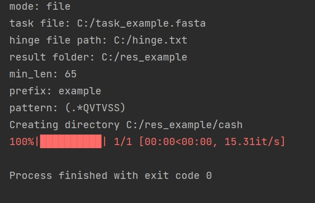
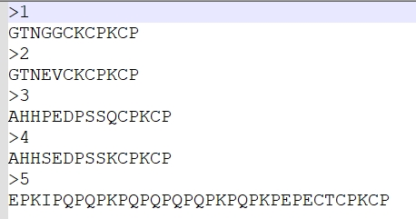

# Hinge Knitter
___
## Description

## Usage
___
- run the script(main.py) in your python(3.6+) interpreter
- run HingeKnitter.exe file
___

**Parameters:**
- **mode**(radiobuttons):
  - folder: program will process folder with task files
  - file: program will process only one given file
- **paths**(3 buttons):
    - to the task folder/file
    - to the folder where processed file(-s) will be saved, 
  also a cash folder(file(-s) with sequences where _pattern_ wasn't found) will be created here
    - to the file with hinge sequences
- **prefix**(default=file):
  - prefix for the processed file(-s), will use for naming processed file(-s)
- **pattern**(default=QVTVSS):
  - sequences with *pattern* at the end will be processed
- **minimum length of sequence**(default=90 symbols):
  - min=50, max=150
  - reads in the processed file(-s) will divide into two 
  groups(1. length of read < min_len and 2. length of read >= min_len)
  and after processing will be writen in two 
  files(*prefix*_short_num and *prefix*_long_num)

## Example of file processing by the HingeKnitter

Start parameters:

Console:

Hinge:

**Result:**

Directory:

Example of processed sequence(pattern=QVTVSS):
- before:

`>3325 seqnameXXX`
`GRFTISRDNPKNTLYLQLNSLKTEDAAMYYCLIREGYWGQGT`**QVTVSS**`AAAESW`
- after:

